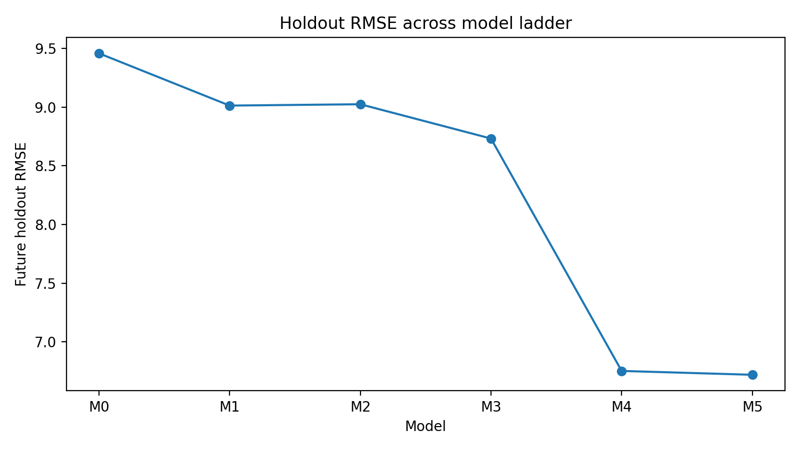

# Interpretable Retail Demand Modeling with Heterogeneity Controls and Time-Aware Validation

This repository reframes a course-originated grocery-sales exercise as a research-oriented portfolio project.  
The original analysis compared a log-linear model against a quasi-Poisson count model on weekly frozen-pizza sales, using manufacturer controls and random 10-fold cross-validation. The portfolio version asks a broader methods question:

> **When predicting overdispersed weekly retail demand, how much do model family, heterogeneity controls, and validation design change the conclusions?**

## Why this project is portfolio-worthy

The original coursework already identified three useful modelling instincts:

- `UNITS` is a non-negative count with strong overdispersion, so a plain Poisson assumption is not credible.
- `BASE_PRICE` and temporary discount depth should be separated rather than merged into a single price term.
- Potential DISPLAY interactions should be screened, not assumed, and kept only if out-of-sample evidence supports them.

The portfolio upgrade goes further by introducing:

- **time-aware validation** instead of relying only on random folds,
- **product and store heterogeneity controls** (`UPC`, `STORE_NUM`),
- **seasonal time structure** beyond a single linear trend,
- **robustness checks** using negative binomial models.

## Data scope

The data are store–product–week observations for frozen pizza sales.  
The original assignment describes 12 products observed across 156 weeks, with identifiers for store, product, manufacturer, and three promotion flags.  

Because the raw CSV came from course materials, this public repository **does not include the raw data file by default**.  
Place the CSV manually at:

```text
data/raw/grocery.csv
```

and then run the scripts below.

## Main result

The upgraded analysis tests six candidate specifications.  
The strongest result is **not** that count models slightly beat log-linear models.  
The stronger result is that **heterogeneity controls dominate interaction tinkering once evaluation is aligned with future-week forecasting**.

### Model comparison summary

| Model | Description | Rolling RMSE | Future holdout RMSE |
|---|---|---:|---:|
| M0 | Log-linear baseline + manufacturer + linear trend | 9.980 | 9.458 |
| M1 | Pooled count baseline + manufacturer + linear trend | 9.671 | 9.013 |
| M2 | M1 + seasonal harmonics | 9.629 | 9.024 |
| M3 | M2, but manufacturer replaced by `UPC` fixed effects | 9.221 | 8.732 |
| M4 | M3 + `STORE_NUM` fixed effects | **7.748** | **6.753** |
| M5 | M4 + DISPLAY interactions | 7.762 | 6.720 |




### Practical interpretation

- Moving from the pooled count baseline (M1) to the main upgraded model (M4) reduces future-holdout RMSE from **9.013** to **6.753**, a **25.1%** improvement.
- The DISPLAY-interaction model (M5) is directionally sensible but adds almost no predictive value beyond M4.
- Across rolling folds, the pooled DISPLAY coefficient is around **0.46**, while the `UPC + STORE_NUM` specification reduces it to roughly **0.32**, suggesting pooled models overstate promotion lift if product/store heterogeneity is ignored.
- Negative binomial checks confirm meaningful overdispersion, but the main project story remains the same: **validation design and heterogeneity structure matter more than small family tweaks.**

## Research question

This repository is organized around three linked questions:

1. **Model family:** Is count-based modelling preferable to transformed-linear regression for overdispersed weekly sales?
2. **Heterogeneity:** Do product/store controls materially change prediction quality and the interpretation of promotion effects?
3. **Validation design:** Does future-week forecasting lead to the same ranking as random cross-validation?

## Repository layout

```text
retail-demand-modeling/
├── README.md
├── .gitignore
├── data/
│   ├── README.md
│   └── raw/
├── docs/
│   ├── github_upload_guide_cn.md
│   ├── cv_and_ps_blurbs.md
│   └── publishing_checklist_cn.md
├── figures/
├── notebooks/
│   └── retail_demand_modeling.qmd
├── results/
│   ├── stage2_model_summary.csv
│   ├── stage2_coef_stability.csv
│   └── stage2_nb_checks.csv
└── src/
    ├── 00_setup.R
    ├── 01_data_prep.R
    ├── 02_feature_engineering.R
    ├── 03_model_specs.R
    ├── 04_validation_helpers.R
    ├── 05_run_model_comparison.R
    └── 06_counterfactual_demo.R
```

## How to reproduce

1. Put `grocery.csv` at `data/raw/grocery.csv`.
2. Run `src/05_run_model_comparison.R`.
3. Inspect the generated `.csv` files in `results/`.
4. Render `notebooks/retail_demand_modeling.qmd` for the narrative report.

## What not to upload

Do **not** upload the following into the public GitHub repo:

- the original assignment PDF,
- your student-number-named `.Rmd` and PDF submission,
- the raw grocery CSV unless you are certain redistribution is permitted.

Those files reveal the coursework origin too directly and weaken the portfolio framing.

## Limits of the project

This is **not** a causal promotion-effects project.  
All promotion and price coefficients are predictive associations under observed store–product–week variation.  
The strongest use-case is **future-week forecasting for already-seen stores and UPCs**, not cold-start prediction for unseen products or new stores.

## Suggested citation line for CV / portfolio

**Interpretable Retail Demand Modeling with Heterogeneity Controls and Time-Aware Validation | R**

- Reframed a retail-sales coursework dataset into a reproducible panel demand-modeling project, comparing transformed-linear and count-based models under rolling and future-holdout evaluation.
- Showed that product/store heterogeneity controls materially improved forecasting accuracy and reduced overstated pooled promotion effects, while DISPLAY interactions added little out-of-sample value.
